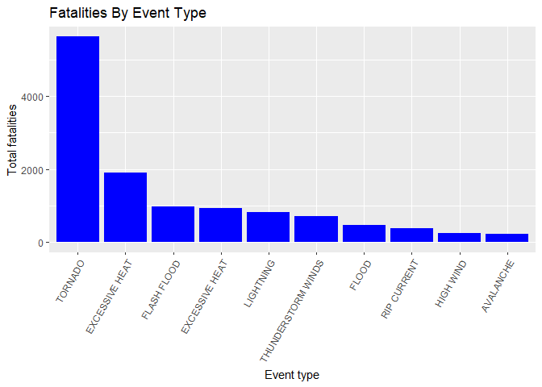
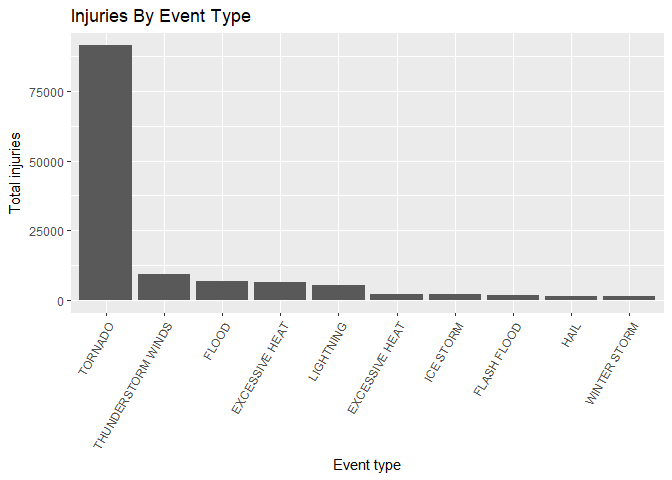
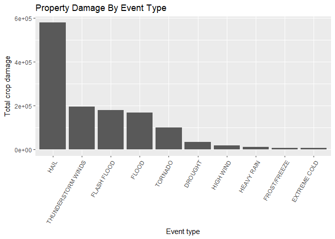

Synopsis
==========

In this report we will analysis the NOAA Storm Events data. The data collected from year 1950 to 2011, 
with 902297 records. Fatalities, injuries, and property damage (in dollars) are totalled over that time.
Data will be cleansed, re-orderd and analyised in order to identified

Data Processing


```r
url = "http://d396qusza40orc.cloudfront.net/repdata%2Fdata%2FStormData.csv.bz2"
download.file(url, dest = "storm.bz2")
stormData<-read.csv(bzfile("storm.bz2"))
head(stormData, 3)
```

```
##   STATE__          BGN_DATE BGN_TIME TIME_ZONE COUNTY COUNTYNAME STATE
## 1       1 4/18/1950 0:00:00     0130       CST     97     MOBILE    AL
## 2       1 4/18/1950 0:00:00     0145       CST      3    BALDWIN    AL
## 3       1 2/20/1951 0:00:00     1600       CST     57    FAYETTE    AL
##    EVTYPE BGN_RANGE BGN_AZI BGN_LOCATI END_DATE END_TIME COUNTY_END
## 1 TORNADO         0                                               0
## 2 TORNADO         0                                               0
## 3 TORNADO         0                                               0
##   COUNTYENDN END_RANGE END_AZI END_LOCATI LENGTH WIDTH F MAG FATALITIES
## 1         NA         0                      14.0   100 3   0          0
## 2         NA         0                       2.0   150 2   0          0
## 3         NA         0                       0.1   123 2   0          0
##   INJURIES PROPDMG PROPDMGEXP CROPDMG CROPDMGEXP WFO STATEOFFIC ZONENAMES
## 1       15    25.0          K       0                                    
## 2        0     2.5          K       0                                    
## 3        2    25.0          K       0                                    
##   LATITUDE LONGITUDE LATITUDE_E LONGITUDE_ REMARKS REFNUM
## 1     3040      8812       3051       8806              1
## 2     3042      8755          0          0              2
## 3     3340      8742          0          0              3
```

Subsetting and summarised require Data 


```r
New_stormData<- stormData[,c("EVTYPE", "FATALITIES", "INJURIES", "PROPDMG","PROPDMGEXP","CROPDMG","CROPDMGEXP")]

summary(New_stormData)
```

```
##                EVTYPE         FATALITIES          INJURIES        
##  HAIL             :288661   Min.   :  0.0000   Min.   :   0.0000  
##  TSTM WIND        :219940   1st Qu.:  0.0000   1st Qu.:   0.0000  
##  THUNDERSTORM WIND: 82563   Median :  0.0000   Median :   0.0000  
##  TORNADO          : 60652   Mean   :  0.0168   Mean   :   0.1557  
##  FLASH FLOOD      : 54277   3rd Qu.:  0.0000   3rd Qu.:   0.0000  
##  FLOOD            : 25326   Max.   :583.0000   Max.   :1700.0000  
##  (Other)          :170878                                         
##     PROPDMG          PROPDMGEXP        CROPDMG          CROPDMGEXP    
##  Min.   :   0.00          :465934   Min.   :  0.000          :618413  
##  1st Qu.:   0.00   K      :424665   1st Qu.:  0.000   K      :281832  
##  Median :   0.00   M      : 11330   Median :  0.000   M      :  1994  
##  Mean   :  12.06   0      :   216   Mean   :  1.527   k      :    21  
##  3rd Qu.:   0.50   B      :    40   3rd Qu.:  0.000   0      :    19  
##  Max.   :5000.00   5      :    28   Max.   :990.000   B      :     9  
##                    (Other):    84                     (Other):     9
```

assigning new column name


```r
New_stormData$EVTYPE <- 
        gsub("^HEAT$", " EXCESSIVE HEAT", New_stormData$EVTYPE)
New_stormData$EVTYPE <- 
        gsub("^TSTM WIND$", "THUNDERSTORM WIND", New_stormData$EVTYPE)
New_stormData$EVTYPE <- 
        gsub("^THUNDERSTORM WIND$", "THUNDERSTORM WINDS", New_stormData$EVTYPE)
```

The purpose of the following code is to aggregate the data in order to prepare it for the results. Data will be aggregated (SUM) on Event Type level, the TOP 10 events will be then indentified.


```r
agg_fatData <-
        aggregate(
                New_stormData$FATALITIES, 
                by=list(New_stormData$EVTYPE), FUN=sum, na.rm=TRUE)
colnames(agg_fatData) <- c("event.type", "fatality.total")
fatalities.sorted <- 
        agg_fatData[order(-agg_fatData$fatality.total),] 
top.fatalities <- fatalities.sorted[1:10,]
top.fatalities$event.type <- 
        factor(
                top.fatalities$event.type, levels=top.fatalities$event.type, 
                ordered=TRUE)
```

Ploting graph for Top 10  causes of Fatalities

In this case Tornado are most harmful events for population.


```r
library(ggplot2)
ggplot(data=top.fatalities, aes(x=event.type, y=fatality.total)) + 
        geom_bar(stat="identity",fill= "blue") + xlab("Event type") + ylab("Total fatalities") + 
        ggtitle("Fatalities By Event Type")+
        theme(axis.text.x = element_text(angle = 60, hjust = 1))
```

<!-- -->


Aggregate data on injuries to find which events are the top 10 causes of injuries


```r
agg_injData <-
        aggregate(
                New_stormData$INJURIES, 
                by=list(New_stormData$EVTYPE), FUN=sum, na.rm=TRUE)
colnames(agg_injData) <- c("event.type", "injury.total")
injuries.sorted <- agg_injData[order(-agg_injData$injury.total),] 
top.injuries <- injuries.sorted[1:10,]
top.injuries$event.type <- 
        factor(
                top.injuries$event.type, levels=top.injuries$event.type, 
                ordered=TRUE)
```

Ploting graph for Top 10  causes of injuries


```r
ggplot(data=top.injuries, aes(x=event.type, y=injury.total)) + 
        geom_bar(stat="identity") + xlab("Event type") + ylab("Total injuries") + 
        ggtitle("Injuries By Event Type") +
        theme(axis.text.x = element_text(angle = 60, hjust = 1))
```

<!-- -->

Aggregate data on Property Damage to find which events are the top 10 causes of Property Damage.


```r
agg_prodamData <-
        aggregate(
                New_stormData$PROPDMG, 
                by=list(New_stormData$EVTYPE), FUN=sum, na.rm=TRUE)
colnames(agg_prodamData) <- c("event.type", "prop.dmg.total")
prop.dmg.sorted <- agg_prodamData[order(-agg_prodamData$prop.dmg.total),] 
top.prop.dmg <- prop.dmg.sorted[1:10,]
top.prop.dmg$event.type <- 
        factor(
                top.prop.dmg$event.type, levels=top.prop.dmg$event.type, 
                ordered=TRUE)
```


Ploting graph for Top 10  causes of Property Damage.

```r
ggplot(data=top.prop.dmg, aes(x=event.type, y=prop.dmg.total)) + 
        geom_bar(stat="identity") + xlab("Event type") + 
        ylab("Total property damage") +  ggtitle("Property Damage By Event Type") + 
        theme(axis.text.x = element_text(angle = 60, hjust = 1))
```

<!-- -->

Aggregate data on crop Damage to find which events are the top 10 causes of crop Damage.


```r
agg_cropData <-
        aggregate(
                New_stormData$CROPDMG, 
                by=list(New_stormData$EVTYPE), FUN=sum, na.rm=TRUE)
colnames(agg_cropData) <- c("event.type", "crop.dmg.total")
crop.dmg.sorted <- agg_cropData[order(-agg_cropData$crop.dmg.total),] 
top.crop.dmg <- crop.dmg.sorted[1:10,]
top.crop.dmg$event.type <- 
        factor(
                top.crop.dmg$event.type, levels=top.crop.dmg$event.type, 
                ordered=TRUE)
```

Ploting graph for Top 10  causes of crop Damage.
This graph showa hail is most charmful cause for Crops


```r
ggplot(data=top.crop.dmg, aes(x=event.type, y=crop.dmg.total)) + 
        geom_bar(stat="identity") + xlab("Event type") + 
        ylab("Total crop damage") +  ggtitle("Property Damage By Event Type") + 
        theme(axis.text.x = element_text(angle = 60, hjust = 1))
```

<!-- -->


Tornados caused the maximum number of fatalities and injuries
